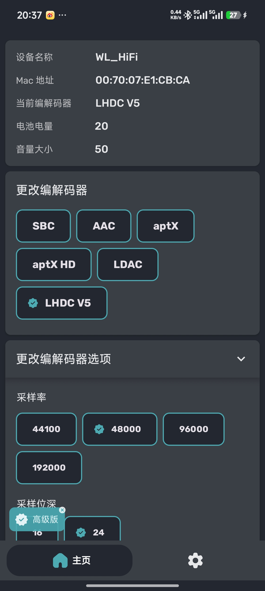

# MLX_Player_ClassicBT

使用 ESP32-D0WD 核心的 ESP32 音乐播放器，支持拓展协议的 A2DP 编码，包括 SBC、AAC、aptX[-LL/-HD]、LDAC、opus 05 (PipeWire)、LC3plus HR、LHDC V5 编码。

> Current branch use the esp-idf branch [a2dp-codecs/v5.1.4](https://github.com/sprlightning/esp-idf-bt-multiple-codecs/tree/a2dp-codecs/v5.1.4), and need PSRAM.   
> If you are find a internal way, you can use the branch [dev/v6.1.0](https://github.com/sprlightning/MLX_Player_ClassicBT/tree/dev/v6.1.0) , and it will use the esp-idf branch [a2dp-codecs/v6.1.0](https://github.com/sprlightning/esp-idf-bt-multiple-codecs/tree/a2dp-codecs/v6.1.0) .

This example proves **esp32-d0wd can decode LHDC V5 at 192kHz/24bit with 0 stuck and 0 pop**. More details please visit the [disscussion](https://github.com/sprlightning/esp-idf-bt-multiple-codecs/discussions) .

> Example demo use the ESP32-CAM module (also called ESP-32S, chip is esp32-d0wd, 4MB Flash, 8MB PSRAM) with PCM5102A DAC module.

# Supported Codecs

| Codec | Rates / depth | Notes |
|-------|---------------|-------|
| **[LDAC](https://github.com/cfint/libldac-dec/tree/esp32)** | up to 96 kHz / 32-bit | 660 / 909 / 990 kbps |
| **[LHDC V5](https://github.com/sprlightning/LHDC-V5-Decoder/tree/esp32-d0wd)** | up to 192 kHz / 24-bit | 400–1000 kbps |
| **[aptX / aptX-HD / aptX-LL](https://github.com/cfint/libfreeaptx-esp/tree/master)** | up to 48 kHz / 24-bit | |
| **[Opus](https://github.com/xiph/opus/tree/main)** | 48 kHz | |
| **[LC3plus](https://github.com/cfint/liblc3/tree/esp32)** | up to 96 kHz | |
| **[AAC](https://github.com/cfint/arduino-fdk-aac/tree/idf_component)** | up to 48 kHz | Helix decoder |
| **[SBC](components/bt/host/bluedroid/external/sbc)** | 44.1 / 48 kHz | stock baseline |

# How to USE

First clone this repository, and then run `idf.py build`.

# How to Switch Codecs

Use [Bluetooth Codec Changer](https://play.google.com/store/apps/details?id=com.amrg.bluetooth_codec_converter).

